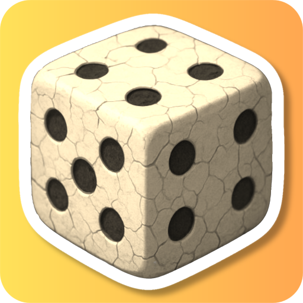
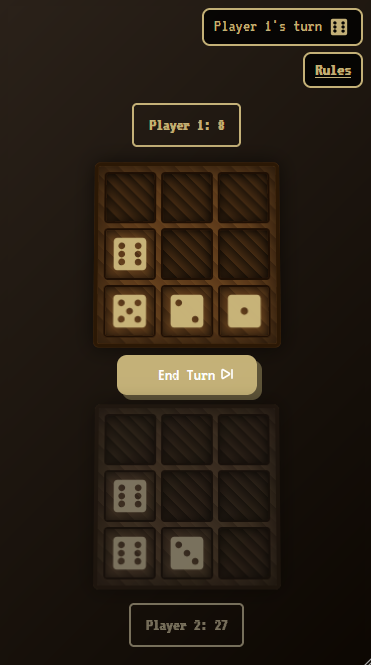

<a id="readme-top"></a>

<br />
<div align="center">
  <a href="https://github.com/Zero2164/knucklebones-dice-game">
    
  </a>

<h3 align="center">Knucklebones</h3>

  <p align="center">
    A browser-based fan-made adaptation of the Knucklebones dice game from Cult of the Lamb.
    <br />
    <a href="https://knucklebones-dicegame.web.app">View Demo</a>
  </p>
</div>

<details>
  <summary>Table of Contents</summary>
  <ol>
    <li>
      <a href="#about-the-project">About The Project</a>
      <ul>
        <li><a href="#built-with">Built With</a></li>
      </ul>
    </li>
    <li>
      <a href="#getting-started">Getting Started</a>
      <ul>
        <li><a href="#prerequisites">Prerequisites</a></li>
      </ul>
    </li>
    <li><a href="#how-to-play">How to Play</a></li>
    <li><a href="#roadmap">Roadmap</a></li>
    <li><a href="#contributing">Contributing</a></li>
    <li><a href="#license">License</a></li>
    <li><a href="#contact">Contact</a></li>
    <li><a href="#acknowledgments">Acknowledgments</a></li>
  </ol>
</details>

## About The Project

[](https://knucklebones-dicegame.web.app)
This project is a free, open-source web adaptation of the Knucklebones dice game featured in [*Cult of the Lamb*](https://cult-of-the-lamb.fandom.com/wiki/Knucklebones). It runs entirely in the browser on desktop and mobile, offering a faithful fan recreation of the original mini-game’s mechanics, but features a new user interface and original game board designs I created.

🔗 Learn more about the original Knucklebones game here:  
[Knucklebones on Cult of the Lamb Wiki](https://cult-of-the-lamb.fandom.com/wiki/Knucklebones)

> **Disclaimer:** This is a fan-made, open-source project and is not affiliated with Massive Monster, Devolver Digital, or Cult of the Lamb.

<p align="right">(<a href="#readme-top">back to top</a>)</p>

### Built With


<p align="right">(<a href="#readme-top">back to top</a>)</p>

## Getting Started

To run Knucklebones locally, clone the repository and open `index.html` in your browser.

### Prerequisites

* A modern browser (Chrome, Firefox, Safari, Edge).


### Local Development Installation

```bash
git clone https://github.com/Zero2164/knucklebones-dice-game.git
cd knucklebones-dice-game
```
Then open index.html.
<p align="right">(<a href="#readme-top">back to top</a>)</p>

## How to Play

The game is faithful to the [rules of the original Knucklebones mini game.](https://cult-of-the-lamb.fandom.com/wiki/Knucklebones) 
- Two players take turns rolling a die and placing it on their 3×3 board.
- Matching dice in the same column multiply their total value.
- Placing a die with the same number in the same column as what's on your opponent’s board knocks out matching dice.
- The game ends when one board is full; the player with the highest score wins.
<p align="right">(<a href="#readme-top">back to top</a>)</p>

## Roadmap 

Some unplanned ideas I had for this project:
* Add Online Muliplayer with lobby support

* Add Computer/AI Player and difficulty levels

* Improve accessibility (ARIA roles, high-contrast mode)


<p align="right">(<a href="#readme-top">back to top</a>)</p>

## Contributing

Contributions are what make the open source community such an amazing place to learn and create. Please fork the repo, create a feature branch, and submit a pull request.
<p align="right">(<a href="#readme-top">back to top</a>)</p>

## License

Distributed under the MIT License. See LICENSE for details.
<p align="right">(<a href="#readme-top">back to top</a>)</p>

## Contact

Kyle Lamont - hello@kyle-lamont.me

Project Link: [https://github.com/Zero2164/knucklebones-dice-game](https://github.com/Zero2164/knucklebones-dice-game)
<p align="right">(<a href="#readme-top">back to top</a>)</p>


## Acknowledgments

* Inspired by [Cult of the Lamb](https://www.cultofthelamb.com/) by Massive Monster and Devolver Digital. This project is fan-made and not affiliated with or endorsed by them.
* [VT323 Font](https://fonts.googleapis.com/css2?family=VT323&display=swap) by Google Fonts
* [Dice Favicon](https://www.flaticon.com/authors/bearicons) by bearicons on [Flaticon](https://www.flaticon.com/)
* [Game Background Music and Effects](https://pixabay.com/users/freesound_community-46691455/?utm_source=link-attribution&utm_medium=referral&utm_campaign=music&utm_content=17221) by [freesound_community](https://pixabay.com//?utm_source=link-attribution&utm_medium=referral&utm_campaign=music&utm_content=17221) on Pixabay

<p align="right">(<a href="#readme-top">back to top</a>)</p>